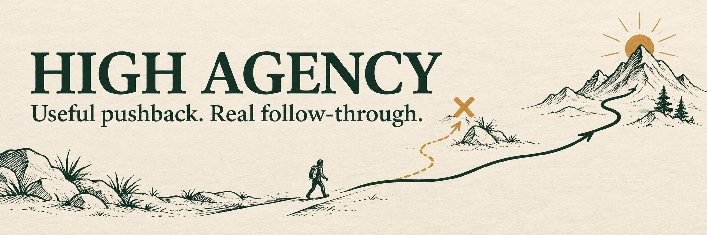

# high-agency

High Agency is a small skill for AI coding agents that adds useful pushback and follow-through. It helps an agent protect your goal when the method you proposed is likely to work against it, then move the task forward with evidence and verification.

## What it does

- Preserves the outcome you want while treating the proposed method as open to review.
- Explains a concern through its likely consequence, supporting evidence, and a better path.
- Continues with safe, reversible work instead of repeatedly asking for approval.
- Verifies results and reports real uncertainty or blockers plainly.

The skill does not grant extra permissions, replace your decisions, or guarantee a correct outcome. It works best when the agent can inspect the relevant code, data, or documentation.

## Install

Clone this repository, then copy the skill folder into your project.

```sh
git clone https://github.com/Cjbuilds/high-agency.git
```

Replace `/path/to/high-agency` below with the clone location. Review an existing installed copy before replacing it.

For Codex:

```sh
mkdir -p .agents/skills
cp -R /path/to/high-agency/skills/high-agency .agents/skills/
```

For Claude Code:

```sh
mkdir -p .claude/skills
cp -R /path/to/high-agency/skills/high-agency .claude/skills/
```

## Use

Invoke it by name in your request:

```text
Use $high-agency to diagnose why this endpoint is slow and fix the root cause.
```

The agent will load `SKILL.md`, inspect the task, challenge a risky method when the evidence warrants it, and pursue the smallest authorized path to a verified result.

## Check the package

The checker uses only the Python standard library:

```sh
python3 scripts/check.py
```

It validates the skill metadata, decision examples, installation instructions, and repository links.

## Files

```text
high-agency/
├── assets/
│   └── banner.png
├── eval/
│   └── RESULTS.md
├── scripts/
│   └── check.py
├── skills/
│   └── high-agency/
│       └── SKILL.md
├── LICENSE
└── README.md
```

## Behavioral evaluation

Tested on three matched tasks with Fable 5.1 and GPT-6 Astra. Baseline and skill conditions both passed the final checks; this small test does not prove an improvement. Read the [method, outputs and limits](eval/RESULTS.md).

```sh
python3 eval/check_cases.py
```

## Limits

This skill cannot supply missing credentials, bypass required approvals, or make irreversible actions safe. It encourages evidence-based judgment, but the quality of the result still depends on the available evidence and tools.
